<h1 align="center">Kepler</h1>

<p align="center">
  <strong>Context-aware coordination for Codex projects.</strong><br>
  Plan the trajectory. Dispatch exact workers. Carry forward only what matters.
</p>

<p align="center">
  
</p>

Kepler coordinates engineering work across existing Codex projects. It keeps a
user-confirmed architecture map, a lightweight revisioned Plan, focused
ContextPacks, exact dispatch receipts, structured WorkerResults, and scoped
memory. Repositories stay where they are. Workers remain ordinary,
full-capability Codex tasks.

> Sol plans. Terra dispatches. Codex executes. Kepler remembers.

## The control loop

```text
objective → Plan → ContextPack → worker → WorkerResult → next ready unit
                         │
                         └── exact dispatch receipt; coordinator stops
```

Kepler solves the repeated-context problem without turning coordination into a
second implementation runtime. Each worker receives a useful starting point,
not a restrictive sandbox. Each result carries forward evidence and decisions,
not a copied transcript.

| Component | Role | Hard boundary |
|---|---|---|
| **Sol** | Inspects evidence, maps dependencies, and revises the Plan | Does not implement or dispatch |
| **Terra** | Verifies the exact project and Plan revision, then launches ready work | Returns the receipt and stops |
| **Plan** | Records the objective, constraints, units, dependencies, and readiness | Remains lightweight; it is not a workflow engine |
| **ContextPack** | Gives one worker a small, auditable starting context | Never limits what the worker may inspect |
| **WorkerResult** | Returns changes, discoveries, decisions, failed attempts, and validation | Never copies the full worker transcript |
| **Memory** | Stores typed, sourced, scoped, invalidatable knowledge | Retrieves a small relevant set, never everything |

## Flight rules

- Exact project and path verification comes before dispatch.
- Material Plan changes create a new visible revision.
- Workers stay directly accessible and fully capable.
- Dispatch ends with a receipt; Kepler does not monitor in the background.
- Commits, remote writes, deployments, publication, and other consequential
  actions retain explicit approval gates.
- Kepler is not a daemon, monorepo manager, transcript synchronizer, Mission or
  Operation control plane, or generalized lifecycle framework.

## Launch sequence

1. Follow the [installation guide](docs/install.md).
2. Create or open a normal control project such as `Kepler-Acme`.
3. Keep application, platform, and other repositories as their own Codex
   projects.
4. Run `/kepler setup` and confirm the exact projects, paths, domains, and
   relationships.
5. Confirm the generated ArchitectureMap, then run `/kepler doctor`.

Setup stores references and coordination state. It does not copy, import, or
edit connected repositories.

## Operating loop

```text
/kepler plan
<describe the engineering outcome>

/kepler dispatch
/kepler status
```

Refine an active Plan in ordinary conversation. Open any worker directly when
useful. Return to the Kepler control project for cross-project status and the
next ready dispatch.

## Navigation

| Guide | Use it for |
|---|---|
| [Workflow](docs/workflow.md) | The end-to-end planning and dispatch loop |
| [Commands](docs/commands.md) | `/kepler` command semantics and boundaries |
| [Architecture](docs/architecture.md) | Sol, Terra, control state, and project routing |
| [Plan contract](docs/contracts/plan.md) | Versioned Plan schema and readiness rules |
| [ContextPack contract](docs/contracts/context-pack.md) | Context budgets, provenance, and worker policy |
| [WorkerResult contract](docs/contracts/worker-result.md) | Structured results and downstream handoffs |
| [Memory](docs/memory.md) | Scope, retrieval, conflict, decay, and privacy |
| [Troubleshooting](docs/troubleshooting.md) | Doctor findings and recovery paths |

## Upgrade and migration

Plugin upgrades and control-project migrations are separate authorization
boundaries. See the [upgrade guide](docs/upgrade.md).

Flightdeck to Kepler is a clean break: preserve the old control project as a
rollback snapshot, install Kepler separately, create a new Kepler control
project, reconnect repositories by verified exact path, confirm a new
ArchitectureMap, and run Doctor. Do not import legacy tasks or transcripts.
See the [migration guide](docs/migration-from-flightdeck.md).

## Repository map

- `plugins/kepler/` — distributable plugin
- `.agents/plugins/marketplace.json` — repository-local marketplace entry
- `docs/` — architecture, workflow, contracts, operations, and migration
- `plugins/kepler/skills/kepler-setup/` — generated control-project template

The v1 boundary is recorded in [ADR 0001](docs/decisions/0001-kepler-v1-redesign.md).
Maintainers should use the [setup runbook](plugins/kepler/skills/kepler-setup/references/setup-runbook.md)
and [repository bridge runbook](plugins/kepler/skills/kepler-repo-bridge/references/configure-bridge-repos.md).
